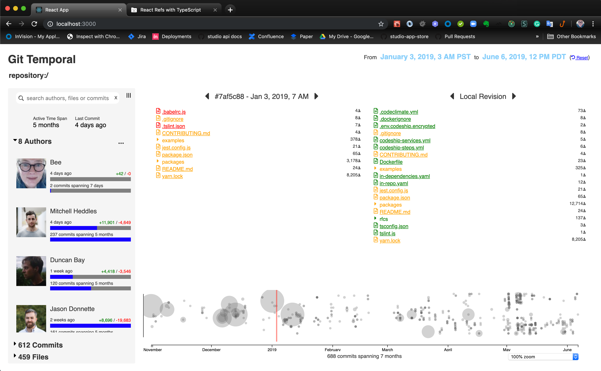
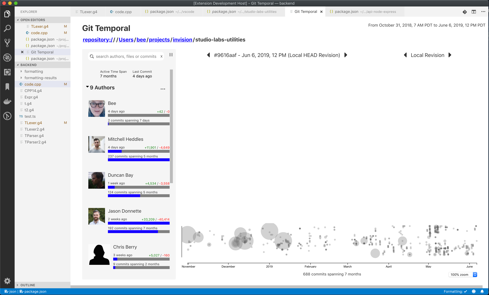
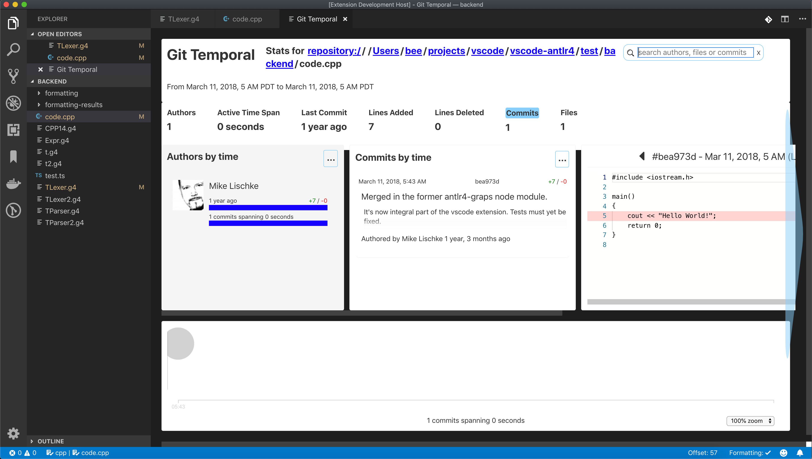

<!-- START doctoc generated TOC please keep comment here to allow auto update -->
<!-- DON'T EDIT THIS SECTION, INSTEAD RE-RUN doctoc TO UPDATE -->

- [Git Temporal](#git-temporal)
  - [Running the alpha proof of concept:](#running-the-alpha-proof-of-concept)
    - [Clone the repo and install dependencies](#clone-the-repo-and-install-dependencies)
    - [Start the log scraping service](#start-the-log-scraping-service)
    - [Start the hot UI Server](#start-the-hot-ui-server)
- [Updates](#updates)
  - [June 10, 2019](#june-10-2019)
  - [May 29, 2019](#may-29-2019)
  - [May 11, 2019](#may-11-2019)
  - [_Coming Soon to a Code Editor / Electron Desktop Near You!_](#_coming-soon-to-a-code-editor--electron-desktop-near-you_)

<!-- END doctoc generated TOC please keep comment here to allow auto update -->

# Git Temporal

## Running the alpha proof of concept:

### Clone the repo and install dependencies

```bash
git clone https://github.com/git-temporal/git-temporal.git
cd git-temporal
npx lerna bootstrap
```

### Start the log scraping service

```bash
cd packages/api-node-express
npm run start
```

### Start the hot UI Server

_in a separate terminal from above:_

```bash
cd packages/git-temporal-react
npm run start
```

# Updates

## June 10, 2019

We have a new look!

[]

And it almost all works in VSCode!

[]

I've also been busy bringing the version of react up to 16.8 and react-redux to 7.1.0-alpha4 and beginning refactoring of the redux containers to functional components using hooks

## May 29, 2019

We have git-temporal running in VSCode!!

This was one that I kept saying to myself would never work, but it almost all did. The only casulty was the List component from react-virtualized used for rendering the commits list. Unfortunately, the rv CellMeasurer which is needed by the commits list because the cards are not fixed height, refused to work in a vscode webview. I replaced it with a too simple ExtendingList component. Everything else, including embedding a monaco difference viewer inside a vscode webview (that'll never work) and D3 (that'll never work) worked!

[]

It looks like ass, but it works. The design needs rethinking. Here's what I'm thinking:

1. The difference viewer should be the primary display component.
1. Fold the search, stats, authors, files and commits into collapsible side panel with a two tier tree like thing like:

```text
    <search/>

    + Stats
      Created: 2 years ago
      Active Time Span: 11 months
      Last Commit:  1 year ago

    + Authors (23)          by time
      <image/> Peter Gibbons (2 minutes ago)
               (44 commits)
      <image/> Bill Lumberg (5 days ago)
               (2 commits)
      ... show more

    + Commits (12,456)      by time
      <tiny commit card>
      <tiny commit card>
      <tiny commit card>
      ... show more

    + Files (78)            by time
      <tiny file card>
      <tiny file card>
      <tiny file card>
      ... show more
```

## May 11, 2019

Demo of alpha POC (git-temnporal-react package) running in the React / Webpack hot server.
https://git-temporal.github.io/git-temporal/docs/design/git-temporal-teaser.mp4

## _Coming Soon to a Code Editor / Electron Desktop Near You!_

[](https://www.invisionapp.com/studio)

```

```
