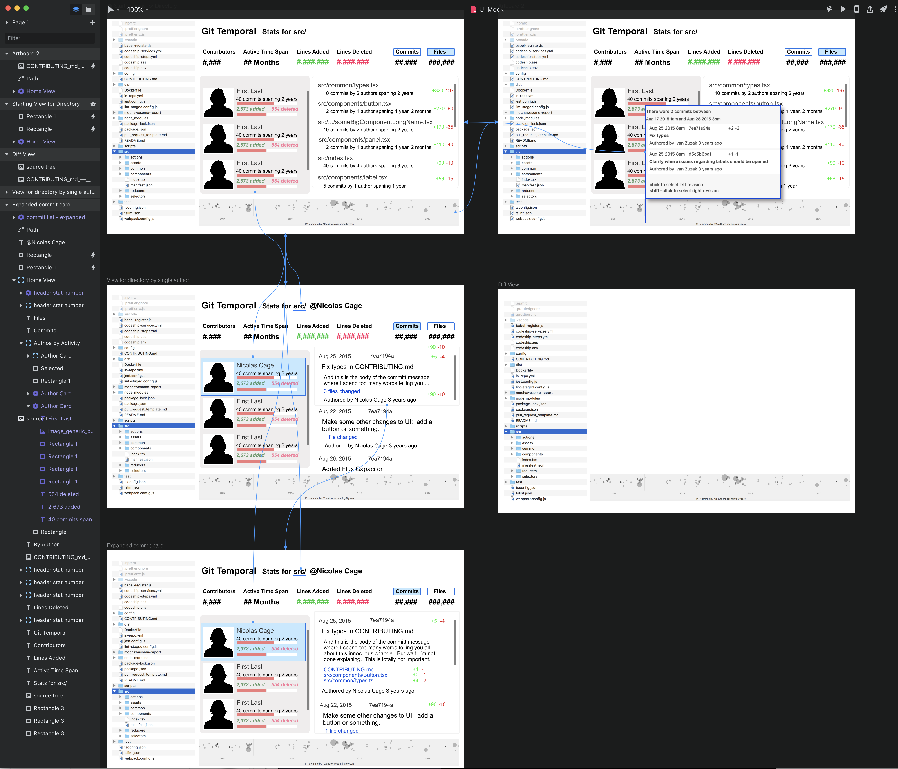

<!-- START doctoc generated TOC please keep comment here to allow auto update -->
<!-- DON'T EDIT THIS SECTION, INSTEAD RE-RUN doctoc TO UPDATE -->

- [Git Temporal](#git-temporal)
  - [Running the alpha proof of concept:](#running-the-alpha-proof-of-concept)
    - [Clone the repo and install dependencies](#clone-the-repo-and-install-dependencies)
    - [Start the log scraping service](#start-the-log-scraping-service)
    - [Start the hot UI Server](#start-the-hot-ui-server)
  - [_Coming Soon to a Code Editor / Electron Desktop Near You!_](#_coming-soon-to-a-code-editor--electron-desktop-near-you_)

<!-- END doctoc generated TOC please keep comment here to allow auto update -->

# Git Temporal

## Running the alpha proof of concept:

### Clone the repo and install dependencies

```bash
git clone https://github.com/git-temporal/git-temporal.git
cd git-temporal
npx lerna bootstrap
```

### Start the log scraping service

```bash
cd packages/api-node-express
npm run start
```

### Start the hot UI Server

_in a separate terminal from above:_

```bash
cd packages/git-temporal-react
npm run start
```

## _Coming Soon to a Code Editor / Electron Desktop Near You!_

[](https://git-temporal.github.io/git-temporal/docs/design/git-temporal-teaser.mp4)

[](https://www.invisionapp.com/studio)
